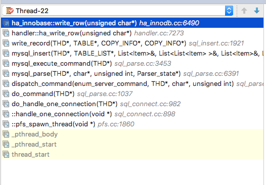

# Procedure Analyze 流程分析

## Basic Flow
- [Flow From Internal Manual](https://dev.mysql.com/doc/internals/en/guided-tour-flow.html)
- [Flow of A Insert Operation](https://dev.mysql.com/doc/internals/en/guided-tour-skeleton.html)

## Slave startup


`main.cc:main` -> `mysqld.cc:mysqld_main` -> `rpl_slave.cc:init_slave` -> `rpl_slave.cc:start_slave_threads`


## Execute a command like `select * from a`


__所有的命令执行：增删改查，show xxx，等等都在`sql_parse.cc:mysql_execute_command`__


### Insert Statement
- Pre
```
# connect to mysql
mysql -uroot -h127.0.0.1 -P3330 -p
...
>use test;
```
- Execute sql
```
>insert into a(`name`) values('zzz');
```

- stack trace of server when client execute insert sql.

注：
- client通过mysql命令行连接到server。server会分配一个新线程来和该client进行后续到交互。（Thread-22）
- 该线程会阻塞到`do_command`，它从网络读取命令，并解析。（阻塞读）。
- 当client键入insert命令并回车，server端从网络接收到该命令，并继续往下执行（在`do_command`）。
- 线程解析命令，并执行，如上图所示。最终在`dispatch_command`中返回client数据。
- 最终线程回到`do_handler_one_connection`中，循环调用`do_command`，并在`do_command`中等待下一个命令的到来。
```
    while (thd_is_connection_alive(thd))//lux 只要连接alive，一直处理请求。比如通过命令行mysql连接过来，只要不退出，就可以执行命令。或者通过Sequel Pro打开一个连接，就可以操作了。
    {
      mysql_audit_release(thd);//lux 权限审核
      if (do_command(thd))//lux 处理请求
  break;
    }//lux 连接dead，下面清理并关闭线程（自己）。
    end_connection(thd);

```
