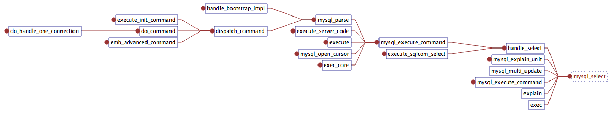
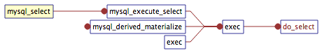

# Procedure Analyze 流程分析

## Basic Flow
- [Flow From Internal Manual](https://dev.mysql.com/doc/internals/en/guided-tour-flow.html)
- [Flow of A Insert Operation](https://dev.mysql.com/doc/internals/en/guided-tour-skeleton.html)

## Slave startup

`main.cc:main` -> `mysqld.cc:mysqld_main` -> `rpl_slave.cc:init_slave` -> `rpl_slave.cc:start_slave_threads`

## Execute a command like `select * from a`

__所有的命令执行：增删改查，show xxx，等等都在`sql_parse.cc:mysql_execute_command`__

