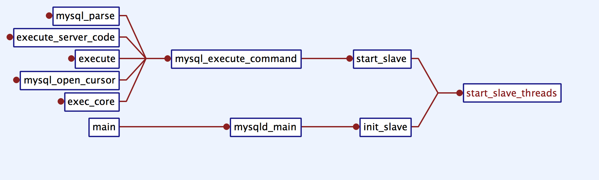
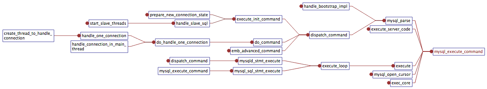

# Procedure Analyze 流程分析

## Slave startup

`main.cc:main` -> `mysqld.cc:mysqld_main` -> `rpl_slave.cc:init_slave` -> `rpl_slave.cc:start_slave_threads`

## Execute a command like `select * from a`

